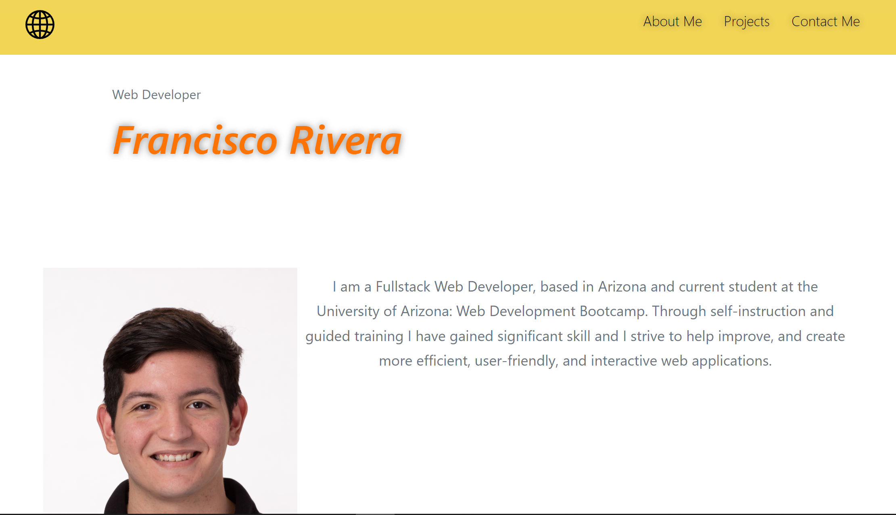

# Fullstack Portfolio
## Description
  
- Reason behind the project: To create an app where I can display my projects, skills and contact information.
- Purpose or Problem Solved: .
- Important information learned: .
  
## Table of Contents (Optional)
  
- [Usage](#usage)
- [Credits](#credits)
- [License](#license)
- [Tests](#tests)
- [Questions](#questions)
  

## Usage
  
Go to: https://frivera14.github.io/portfolio/ & click on the project cards to follow to the depoled links.

  
## Credits
  
Collaborators: None 
  
## License
  
Unlicensed

## Questions
  
All questions and communications can be directed to:
Github: github.com/frivera14 
